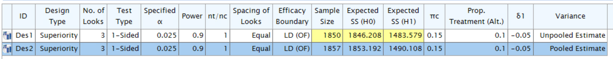

```{r, message=FALSE, warning=FALSE, echo=FALSE}
library(gsDesign)
library(dplyr)
library(gt)
library(testthat)
library(tibble)
library(gsdmvn)
#devtools::load_all()
```

# `gs_power_npe` 

## Case 1 {.tabset}

### `info_scale = 0`
```{r}
gs_power_npe(
  theta = .1, 
  info = 700, 
  info_scale = 0,
  upper = gs_spending_bound,
  lower = gs_spending_bound,
  upar = list(par = list(sf = gsDesign::sfLDOF, total_spend = 0.025, param = NULL, timing = NULL),
              info = 500),
  lpar = list(par = list(sf = gsDesign::sfLDOF, total_spend = 0.025, param = NULL, timing = NULL)),
  test_upper = TRUE,
  test_lower = TRUE) %>% gt()
```

### `info_scale = 1`
```{r}
gs_power_npe(
  theta = .1, 
  info = 700, 
  info_scale = 1,
  upper = gs_spending_bound,
  lower = gs_spending_bound,
  upar = list(par = list(sf = gsDesign::sfLDOF, total_spend = 0.025, param = NULL, timing = NULL),
              info = 500),
  lpar = list(par = list(sf = gsDesign::sfLDOF, total_spend = 0.025, param = NULL, timing = NULL)),
  test_upper = TRUE,
  test_lower = TRUE) %>% gt()
```


### `info_scale = 2`
```{r}
gs_power_npe(
  theta = .1, 
  info = 700, 
  info_scale = 2,
  upper = gs_spending_bound,
  lower = gs_spending_bound,
  upar = list(par = list(sf = gsDesign::sfLDOF, total_spend = 0.025, param = NULL, timing = NULL),
              info = 500),
  lpar = list(par = list(sf = gsDesign::sfLDOF, total_spend = 0.025, param = NULL, timing = NULL)),
  test_upper = TRUE,
  test_lower = TRUE) %>% gt()
```

## Case 2 {.tabset}

### `info_scale = 0`
```{r}
gs_power_npe(
  theta = .1, 
  info = 700, 
  info_scale = 0,
  upper = gs_spending_bound,
  lower = gs_spending_bound,
  upar = list(par = list(sf = gsDesign::sfLDOF, total_spend = 0.025, param = NULL, timing = NULL)),
  lpar = list(par = list(sf = gsDesign::sfLDOF, total_spend = 0.025, param = NULL, timing = NULL)),
  test_upper = TRUE,
  test_lower = TRUE) %>% gt()
```

### `info_scale = 1`
```{r}
gs_power_npe(
  theta = .1, 
  info = 700, 
  info_scale = 1,
  upper = gs_spending_bound,
  lower = gs_spending_bound,
  upar = list(par = list(sf = gsDesign::sfLDOF, total_spend = 0.025, param = NULL, timing = NULL)),
  lpar = list(par = list(sf = gsDesign::sfLDOF, total_spend = 0.025, param = NULL, timing = NULL)),
  test_upper = TRUE,
  test_lower = TRUE) %>% gt()
```


### `info_scale = 2`
```{r}
gs_power_npe(
  theta = .1, 
  info = 700, 
  info_scale = 2,
  upper = gs_spending_bound,
  lower = gs_spending_bound,
  upar = list(par = list(sf = gsDesign::sfLDOF, total_spend = 0.025, param = NULL, timing = NULL)),
  lpar = list(par = list(sf = gsDesign::sfLDOF, total_spend = 0.025, param = NULL, timing = NULL)),
  test_upper = TRUE,
  test_lower = TRUE) %>% gt()
```


## Case 3 {.tabset}

### `info_scale = 0`
```{r}
gs_power_npe(
  theta = .1, 
  info = 700, 
  info_scale = 0,
  upper = gs_spending_bound,
  lower = gs_spending_bound,
  upar = list(par = list(sf = gsDesign::sfLDOF, total_spend = 0.025, param = NULL, timing = NULL),
              info = 500),
  lpar = list(par = list(sf = gsDesign::sfLDOF, total_spend = 0.025, param = NULL, timing = NULL),
              info = 800),
  test_upper = TRUE,
  test_lower = TRUE) %>% gt()
```

### `info_scale = 1`
```{r}
gs_power_npe(
  theta = .1, 
  info = 700, 
  info_scale = 1,
  upper = gs_spending_bound,
  lower = gs_spending_bound,
  upar = list(par = list(sf = gsDesign::sfLDOF, total_spend = 0.025, param = NULL, timing = NULL),
              info = 500),
  lpar = list(par = list(sf = gsDesign::sfLDOF, total_spend = 0.025, param = NULL, timing = NULL),
              info = 800),
  test_upper = TRUE,
  test_lower = TRUE) %>% gt()
```


### `info_scale = 2`
```{r}
gs_power_npe(
  theta = .1, 
  info = 700, 
  info_scale = 2,
  upper = gs_spending_bound,
  lower = gs_spending_bound,
  upar = list(par = list(sf = gsDesign::sfLDOF, total_spend = 0.025, param = NULL, timing = NULL),
              info = 500),
  lpar = list(par = list(sf = gsDesign::sfLDOF, total_spend = 0.025, param = NULL, timing = NULL),
              info = 800),
  test_upper = TRUE,
  test_lower = TRUE) %>% gt()
```


# `gs_design_npe`

## Case 1 {.tabset}

### `info_scale = 0`
```{r}
gs_design_npe(
  theta = .1,
  info = 700,
  info0 = NULL,
  info_scale = 0,
  upper = gs_spending_bound,
  lower = gs_spending_bound,
  upar = list(par = list(sf = gsDesign::sfLDOF, total_spend = 0.025, param = NULL, timing = NULL),
              info = 500),
  lpar = list(par = list(sf = gsDesign::sfLDOF, total_spend = 0.025, param = NULL, timing = NULL))
  )
```

### `info_scale = 1`
```{r}
gs_design_npe(
  theta = .1,
  info = 700,
  info0 = NULL,
  info_scale = 1,
  upper = gs_spending_bound,
  lower = gs_spending_bound,
  upar = list(par = list(sf = gsDesign::sfLDOF, total_spend = 0.025, param = NULL, timing = NULL),
              info = 500),
  lpar = list(par = list(sf = gsDesign::sfLDOF, total_spend = 0.025, param = NULL, timing = NULL))
  )
```

### `info_scale = 2`
```{r}
gs_design_npe(
  theta = .1,
  info = 700,
  info0 = NULL,
  info_scale = 2,
  upper = gs_spending_bound,
  lower = gs_spending_bound,
  upar = list(par = list(sf = gsDesign::sfLDOF, total_spend = 0.025, param = NULL, timing = NULL),
              info = 500),
  lpar = list(par = list(sf = gsDesign::sfLDOF, total_spend = 0.025, param = NULL, timing = NULL))
  )
```


# Binary Endpoint {.tabset}

## Fixed Design with Un-stratified Population {.tabset}

### `gsdmvn`

If one use `gs_spending_bound`, one can add `info` into the arguments `upar` and `lpar` as follows.
```{r}
x_info <- gs_info_rd(
  p_c = tibble::tibble(Stratum = "All", Rate = .28),
  p_e = tibble::tibble(Stratum = "All", Rate = .4),
  N = tibble::tibble(Stratum = "All", N = 650, Analysis = 1),
  rd0 = 0,
  ratio = 1
)

x_info %>% gt()
```


```{r}
x0 <- gs_design_rd(
  p_c = tibble::tibble(Stratum = "All", Rate = .28),
  p_e = tibble::tibble(Stratum = "All", Rate = .4),
  k = 1,
  rd0 = 0, 
  alpha = 0.025,   
  beta = 0.1,   
  ratio = 1,
  weight = "un-stratified",
  upper = gs_spending_bound,
  lower = gs_spending_bound,
  upar = list(par = list(sf = gsDesign::sfLDOF, total_spend = 0.025, param = NULL, timing = NULL),
              info = x_info$info0),
  lpar = list(par = list(sf = gsDesign::sfLDOF, total_spend = 0.025, param = NULL, timing = NULL),
              info = x_info$info),
  info_scale = 0)  

x1 <- gs_design_rd(
  p_c = tibble::tibble(Stratum = "All", Rate = .28),
  p_e = tibble::tibble(Stratum = "All", Rate = .4),
  k = 1,
  rd0 = 0, 
  alpha = 0.025,   
  beta = 0.1,   
  ratio = 1,
  weight = "un-stratified",
  upper = gs_spending_bound,
  lower = gs_spending_bound,
  upar = list(par = list(sf = gsDesign::sfLDOF, total_spend = 0.025, param = NULL, timing = NULL),
              info = x_info$info0),
  lpar = list(par = list(sf = gsDesign::sfLDOF, total_spend = 0.025, param = NULL, timing = NULL),
              info = x_info$info),
  info_scale = 1) 

x2 <- gs_design_rd(
  p_c = tibble::tibble(Stratum = "All", Rate = .28),
  p_e = tibble::tibble(Stratum = "All", Rate = .4),
  k = 1,
  rd0 = 0, 
  alpha = 0.025,   
  beta = 0.1,   
  ratio = 1,
  weight = "un-stratified",
  upper = gs_spending_bound,
  lower = gs_spending_bound,
  upar = list(par = list(sf = gsDesign::sfLDOF, total_spend = 0.025, param = NULL, timing = NULL),
              info = x_info$info0),
  lpar = list(par = list(sf = gsDesign::sfLDOF, total_spend = 0.025, param = NULL, timing = NULL),
              info = x_info$info),
  info_scale = 2) 

cat("The sample size calculated by `gs_design_rd()` under `info_scale = 0` is ", x0$analysis$N, "\n")
cat("The sample size calculated by `gs_design_rd()` under `info_scale = 1` is ", x1$analysis$N, "\n")
cat("The sample size calculated by `gs_design_rd()` under `info_scale = 2` is ", x2$analysis$N, "\n")
```


But the above input of `info` in the arguments `upar` and `lpar` is optional. 
```{r}
xx0 <- gs_design_rd(
  p_c = tibble::tibble(Stratum = "All", Rate = .28),
  p_e = tibble::tibble(Stratum = "All", Rate = .4),
  k = 1,
  rd0 = 0, 
  alpha = 0.025,   
  beta = 0.1,   
  ratio = 1,
  weight = "un-stratified",
  upper = gs_spending_bound,
  lower = gs_spending_bound,
  upar = list(par = list(sf = gsDesign::sfLDOF, total_spend = 0.025, param = NULL, timing = NULL)),
  lpar = list(par = list(sf = gsDesign::sfLDOF, total_spend = 0.025, param = NULL, timing = NULL)),
  info_scale = 0)

xx1 <- gs_design_rd(
  p_c = tibble::tibble(Stratum = "All", Rate = .28),
  p_e = tibble::tibble(Stratum = "All", Rate = .4),
  k = 1,
  rd0 = 0, 
  alpha = 0.025,   
  beta = 0.1,   
  ratio = 1,
  weight = "un-stratified",
  upper = gs_spending_bound,
  lower = gs_spending_bound,
  upar = list(par = list(sf = gsDesign::sfLDOF, total_spend = 0.025, param = NULL, timing = NULL)),
  lpar = list(par = list(sf = gsDesign::sfLDOF, total_spend = 0.025, param = NULL, timing = NULL)),
  info_scale = 1)

xx2 <- gs_design_rd(
  p_c = tibble::tibble(Stratum = "All", Rate = .28),
  p_e = tibble::tibble(Stratum = "All", Rate = .4),
  k = 1,
  rd0 = 0, 
  alpha = 0.025,   
  beta = 0.1,   
  ratio = 1,
  weight = "un-stratified",
  upper = gs_spending_bound,
  lower = gs_spending_bound,
  upar = list(par = list(sf = gsDesign::sfLDOF, total_spend = 0.025, param = NULL, timing = NULL)),
  lpar = list(par = list(sf = gsDesign::sfLDOF, total_spend = 0.025, param = NULL, timing = NULL)),
  info_scale = 2)

cat("The sample size calculated by `gs_design_rd()` under `info_scale = 0` is ", xx0$analysis$N, "\n")
cat("The sample size calculated by `gs_design_rd()` under `info_scale = 1` is ", xx1$analysis$N, "\n")
cat("The sample size calculated by `gs_design_rd()` under `info_scale = 2` is ", xx2$analysis$N, "\n")
```


### `gsDesign`
```{r}
x <- nBinomial(p1 = .28, p2 = .4, delta0 = 0, alpha = .025, sided = 1, beta = .1, outtype = 3)
cat("The sample size calculated by `gsDesign` is ", x$n, "\n")
```


### EAST 
```{r label = EastFix, echo = FALSE, fig.cap = "Sample size calculated by EAST", out.width = '90%'}
knitr::include_graphics("./figures/east_n_fix.png")
```


## Group Sequential Design with Un-stratified Population 


### `gsdmvn` {.tabset}

```{r}
y0 <- gs_design_rd(
  p_c = tibble::tibble(Stratum = "All", Rate = .15),
  p_e = tibble::tibble(Stratum = "All", Rate = .1),
  k = 3,
  IF = 1:3/3,
  rd0 = 0, 
  alpha = .025,                  
  beta = .1,                
  ratio = 1,
  weight = "un-stratified",
  upper = gs_b,
  lower = gs_b,
  upar = list(par = gsDesign(k = 3, test.type = 1, sfu = sfLDOF, sfupar = NULL)$upper$bound),
  lpar = list(par = rep(-Inf, 3)),
  test_lower = FALSE,
  info_scale = 0
)

y1 <- gs_design_rd(
  p_c = tibble::tibble(Stratum = "All", Rate = .15),
  p_e = tibble::tibble(Stratum = "All", Rate = .1),
  k = 3,
  IF = 1:3/3,
  rd0 = 0, 
  alpha = .025,                  
  beta = .1,                
  ratio = 1,
  weight = "un-stratified",
  upper = gs_b,
  lower = gs_b,
  upar = list(par = gsDesign(k = 3, test.type = 1, sfu = sfLDOF, sfupar = NULL)$upper$bound),
  lpar = list(par = rep(-Inf, 3)),
  test_lower = FALSE,
  info_scale = 1
)

y2 <- gs_design_rd(
  p_c = tibble::tibble(Stratum = "All", Rate = .15),
  p_e = tibble::tibble(Stratum = "All", Rate = .1),
  k = 3,
  IF = 1:3/3,
  rd0 = 0, 
  alpha = .025,                  
  beta = .1,                
  ratio = 1,
  weight = "un-stratified",
  upper = gs_b,
  lower = gs_b,
  upar = list(par = gsDesign(k = 3, test.type = 1, sfu = sfLDOF, sfupar = NULL)$upper$bound),
  lpar = list(par = rep(-Inf, 3)),
  test_lower = FALSE,
  info_scale = 2
)


cat("The sample size calculated by `gsdmvn` is ", y0$analysis$N, ".\n")
cat("The sample size calculated by `gsdmvn` is ", y1$analysis$N, ".\n")
cat("The sample size calculated by `gsdmvn` is ", y2$analysis$N, ".\n")
```


```{r}
y_info <- gs_info_rd(
  p_c = tibble::tibble(Stratum = "All", Rate = .15),
  p_e = tibble::tibble(Stratum = "All", Rate = .1),
  N = tibble::tibble(Stratum = "All", N = c(600, 1200, 1800), Analysis = 1:3),
  rd0 = 0,
  ratio = 1
)

y_info %>% gt()
```


```{r}
yy0 <- gs_design_rd(
  p_c = tibble::tibble(Stratum = "All", Rate = .15),
  p_e = tibble::tibble(Stratum = "All", Rate = .1),
  k = 3,
  IF = 1:3/3,
  rd0 = 0, 
  alpha = .025,                  
  beta = .1,                
  ratio = 1,
  weight = "un-stratified",
  upper = gs_spending_bound,
  lower = gs_spending_bound,
  upar = list(par = list(sf = gsDesign::sfLDOF, total_spend = 0.025, param = NULL, timing = NULL),
              info = y_info$info0),
  lpar = list(par = list(sf = gsDesign::sfLDOF, total_spend = 0.025, param = NULL, timing = NULL),
              info = y_info$info),
  test_lower = FALSE,
  info_scale = 0
)

yy1 <- gs_design_rd(
  p_c = tibble::tibble(Stratum = "All", Rate = .15),
  p_e = tibble::tibble(Stratum = "All", Rate = .1),
  k = 3,
  IF = 1:3/3,
  rd0 = 0, 
  alpha = .025,                  
  beta = .1,                
  ratio = 1,
  weight = "un-stratified",
  upper = gs_spending_bound,
  lower = gs_spending_bound,
  upar = list(par = list(sf = gsDesign::sfLDOF, total_spend = 0.025, param = NULL, timing = NULL),
              info = y_info$info0),
  lpar = list(par = list(sf = gsDesign::sfLDOF, total_spend = 0.025, param = NULL, timing = NULL),
              info = y_info$info),
  test_lower = FALSE,
  info_scale = 1
)

yy2 <- gs_design_rd(
  p_c = tibble::tibble(Stratum = "All", Rate = .15),
  p_e = tibble::tibble(Stratum = "All", Rate = .1),
  k = 3,
  IF = 1:3/3,
  rd0 = 0, 
  alpha = .025,                  
  beta = .1,                
  ratio = 1,
  weight = "un-stratified",
  upper = gs_spending_bound,
  lower = gs_spending_bound,
  upar = list(par = list(sf = gsDesign::sfLDOF, total_spend = 0.025, param = NULL, timing = NULL),
              info = y_info$info0),
  lpar = list(par = list(sf = gsDesign::sfLDOF, total_spend = 0.025, param = NULL, timing = NULL),
              info = y_info$info),
  test_lower = FALSE,
  info_scale = 2
)


cat("The sample size calculated by `gsdmvn` is ", yy0$analysis$N, ".\n")
cat("The sample size calculated by `gsdmvn` is ", yy1$analysis$N, ".\n")
cat("The sample size calculated by `gsdmvn` is ", yy2$analysis$N, ".\n")
```

### `gsDesign`

```{r}
n_fix <- nBinomial(
  # Control event rate
  p1 = .15, 
  # Experimental event rate
  p2 = .1, 
  # Null hypothesis event rate difference (control - experimental)
  delta0 = 0, 
  # 1-sided Type I error
  alpha = .025, 
  # Type II error (1 - Power)
  beta = .1, 
  # Experimental/Control randomization ratio
  ratio = 1) 

cat("The sample size of fixed-design calculated by `gsDesign` is ", n_fix, ".\n")

x <- gsDesign(
  k = 3,
  test.type = 1,
  # 1-sided Type I error
  alpha = .025, 
  # Type II error (1 - Power)
  beta = .1,    
  # If test.type = 5 or 6, this sets maximum spending for futility
  # under the null hypothesis. Otherwise, this is ignored.
  astar = 0,
  timing = 1:3/3,
  sfu = sfLDOF,
  sfupar = NULL,
  sfl = sfLDOF,
  sflpar = NULL,
  # Difference in event rates under alternate hypothesis
  delta = 0,
  # Difference in rates under H1
  delta1 = .05,
  # Difference in rates under H0
  delta0 = 0,
  endpoint = "Binomial",
  # Fixed design sample size from nBinomial above
  n.fix = n_fix)

cat("The sample size calcuated by `gsDesign` is ", x$n.I, ".\n")

gsBoundSummary(x, digits = 4, ddigits = 2, tdigits = 1)
```


### EAST 
```{r label = EastGs, echo = FALSE, fig.cap = "Sample size calculated by EAST", out.width = '90%'}

```
